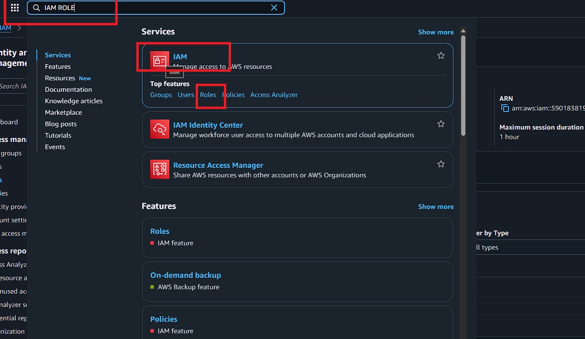
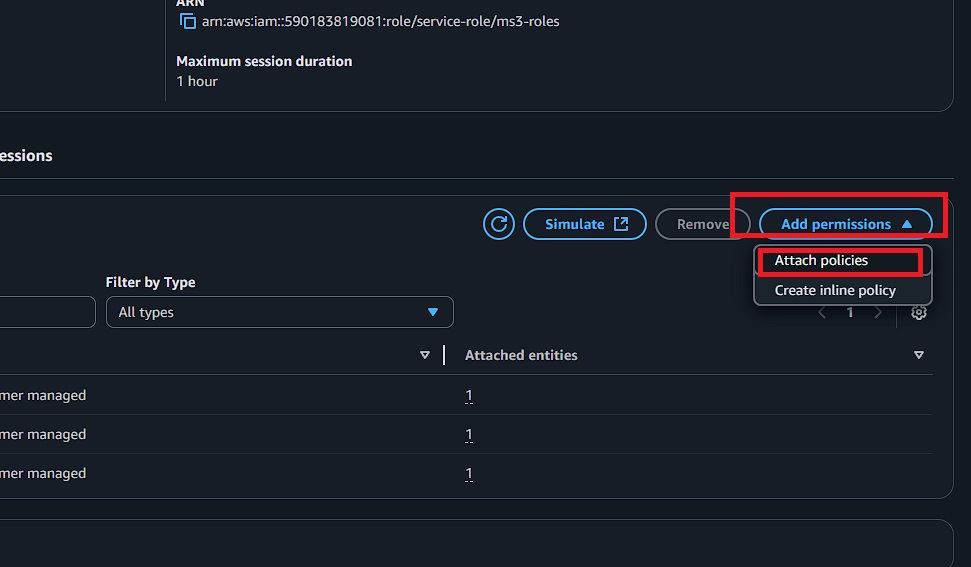

#  Deploy React App with Full CI/CD Pipeline on AWS | GitHub + CodePipeline + S3 🚀

<div align="center">

  <br />
    <a href="https://youtu.be/1k6s4shjpRc?si=NOQo77cZQtTA6eGW" target="_blank">
      
    </a>
  <br />

<h3 align="center">Deploying a React app using EC2 and Terraform</h3>

   <div align="center">
     Build this hands-on demo step by step with my detailed tutorial on <a href="http://www.youtube.com/@julienmuke/videos" target="_blank"><b>Julien Muke</b></a> YouTube. Feel free to subscribe 🔔!
    </div>
</div>

## 🚨 Tutorial

This repository contains the steps corresponding to an in-depth tutorial available on my YouTube
channel, <a href="http://www.youtube.com/@julienmuke/videos" target="_blank"><b>Julien Muke</b></a>.

If you prefer visual learning, this is the perfect resource for you. Follow my tutorial to learn how to build projects
like these step-by-step in a beginner-friendly manner!

<a href="https://youtu.be/1k6s4shjpRc?si=NOQo77cZQtTA6eGW" target="_blank"></a>

## <a name="introduction">🤖 Introduction</a>

In this tutorial, you'll learn how to build a fully automated CI/CD pipeline using AWS CodePipeline, CodeBuild, and Amazon S3 to deploy a React.js application hosted on GitHub. Say goodbye to manual deployments, every time you push to your repo, your app will automatically build and deploy to a static website on S3!

## <a name="steps">🔧 How it Works:</a>

1. Push code to the `main` branch on GitHub.
2. AWS CodePipeline detects the change.
3. AWS CodeBuild installs dependencies and builds the React app.
4. The build output is deployed to the S3 bucket.
5. S3 serves the app as a public static website.

## ➡️ Step 1 - Setup your React.js App on GitHub

First, we’ll set up a React app by cloning the React app from my GitHub repository. You can use your own or follow along with mine. Make sure the app is committed to GitHub.

```bash
git clone https://github.com/monijaman/CI-CD.git
```

## ➡️ Step 2 - Create S3 Bucket for Hosting

1. Go to AWS S3 service and click **Create bucket**.
2. Name it something unique like `ms3-ci-cd`.
3. Keep default settings for now (we'll configure it later).


## ➡️ Step 3 - Create CodePipeline

1. Go to AWS CodePipeline and click **Create pipeline**.
2. Name your pipeline: `ms3-codepipeline`.
3. Create a new service role with these permissions:
   - CloudWatchLogsFullAccess
   - S3FullAccess
   - CodeBuildBasePolicy


4. **Add Source Stage:**
   - Source provider: **GitHub** (connect your GitHub account)
   - Select your repository and branch (the one cloned in Step 1)


5. **Add Build Stage:**
   - Provider: **AWS CodeBuild**
   - Choose **"Create project"**


## ➡️ Step 4 - Create CodeBuild Project

Now let’s set up CodeBuild to build and package your React app for deployment.

**Step-by-step:**

1. Go to AWS CodeBuild and click **Create Build Project**.
2. Name your project (e.g., `react-cicd-pipeline-demo`).

   

3. For Environment, choose a managed image: `aws/codebuild/standard:7.0` (or latest available).
4. Under Buildspec, select **Use a buildspec file**.

   

5. In your GitHub repo, create a file named `buildspec.yml` in the root directory:

   ```yaml
   version: 0.2

   phases:
     install:
       runtime-versions:
         nodejs: 20
       commands:
         - echo Installing dependencies...
         - npm ci --legacy-peer-deps

     build:
       commands:
         - echo Building the React app...
         - npm run build

   artifacts:
     files:
       - "**/*"
     base-directory: dist
     discard-paths: no
   ```

6. **Add Deploy Stage:**

   - Provider: **Amazon S3**
   - Bucket: Select your S3 bucket created earlier
   - Extract file option: **YES**

   
   

7. Review configuration and click **"Create pipeline"**.

Once the pipeline is successfully created, you’ll see it run through the `source` `build` and `deploy` stages.

## ➡️ Step 5 - Configure S3 for Static Website Hosting

1. Go to Amazon S3 console and select your bucket.
2. **Enable Static Website Hosting:**
   - Go to **Properties** tab → **"Static Website Hosting"** → **Edit**
   - Choose **Enable** and set `index.html` as index document


3. **Make Bucket Public:**
   - Go to **Permissions** tab
   - Uncheck **"Block all public access"** → **Save changes**


4. **Add Bucket Policy:**
   - In **Permissions** tab → **Bucket policy** → **Edit**
   - Paste this policy (replace `your-bucket-name` with your actual bucket name):
5. You should see the S3 bucket with objects inside, extracted from our CodePipeline.
6. Now let's make this S3 Bucket public:
   <br>- On the top bar, choose "Properties"


<br>- Scroll down to "Static Website Hosting" and click "Edit"


<br>- Under "Static Website Hosting", choose "Enable"
<br>- And specify `index.html` as the index document, then click "Save"


<br>- Next, edit some permissions, still on the tob bar choose "Permissions"
<br>- Uncheck "Block all public access" to allow public access, then click "Save changes"


<br>- Next, we will add a bucket policy to allow public read access inside our s3 bucket. Here's the sample policy you can use:

✅ Steps to Add Bucket Policy in AWS Console
Go to the S3 console:
👉 https://s3.console.aws.amazon.com/s3

Click your bucket name (e.g., your-bucket-name).

From the left sidebar, click "Permissions" tab.

Scroll down to Bucket policy section.

Click “Edit” (or “Add policy” if none exists).

Paste your policy below (replacing your-bucket-name with your actual bucket name):

```json
{
  "Version": "2012-10-17",
  "Statement": [
    {
      "Sid": "PublicReadGetObject",
      "Effect": "Allow",
      "Principal": "*",
      "Action": "s3:GetObject",
      "Resource": "arn:aws:s3:::your-bucket-name/*"
    }
  ]
}
```

## Add Theese Permission:





⚠️ Replace: `your-bucket-name` with your actual bucket name, then click "Save"


<br>- Go back to the S3 Bucket console, on the top bar, choose Objects, then click on `index.html`
<br>- To visit your React.js App, click on the Object URL.


<br>- You should see your React.js App running on Amazon S3


## ➡️ Step 7 - Fix IAM Permissions (If Build Fails)

If your pipeline fails with S3 access errors, add these permissions to your CodeBuild service role:

1. Go to **IAM Console** → **Roles** → Find your CodeBuild role (e.g., `bangla-service-role`)
2. Add this inline policy:

```json
{
  "Version": "2012-10-17",
  "Statement": [
    {
      "Effect": "Allow",
      "Action": [
        "s3:ListBucket",
        "s3:GetObject",
        "s3:PutObject",
        "s3:DeleteObject"
      ],
      "Resource": [
        "arn:aws:s3:::your-bucket-name",
        "arn:aws:s3:::your-bucket-name/*"
      ]
    }
  ]
}
```

⚠️ **Replace `your-bucket-name` with your actual bucket name**


---

## 🎉 Congratulations!

Your React app is now automatically deployed via CI/CD pipeline:

- **Push code** → **GitHub triggers CodePipeline** → **CodeBuild builds** → **Deploys to S3** → **Live website**
