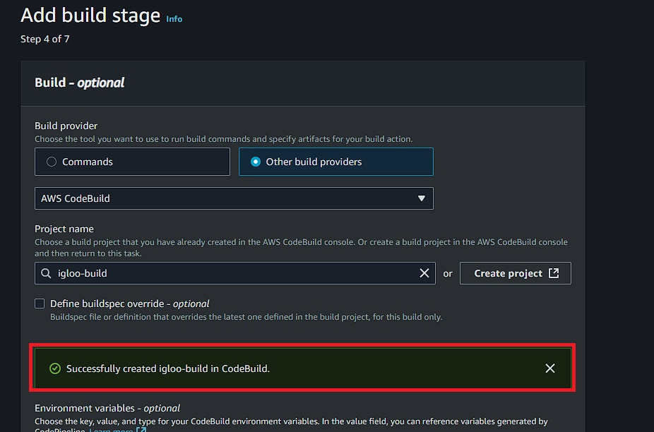

# 🚀 Deploy React App with Full CI/CD Pipeline on AWS

## Overview

This project demonstrates how to set up a complete CI/CD pipeline for a React application using AWS services including CodePipeline, CodeBuild, and S3 for static website hosting.

## <a name="steps">🔧 How it Works:</a>

1. Push code to the `main` branch on GitHub.
2. AWS CodePipeline detects the change.
3. AWS CodeBuild installs dependencies and builds the React app.
4. The build output is deployed to the S3 bucket.
5. S3 serves the app as a public static website.

## ➡️ Step 1 - Setup your React.js App on GitHub

First, we’ll set up a React app by cloning the React app from my GitHub repository. You can use your own or follow along with mine. Make sure the app is committed to GitHub.

```bash
git clone https://github.com/monijaman/CI-CD.git
```

## ➡️ Step 2 - Create S3 Bucket for Hosting

1. Go to AWS S3 service and click **Create bucket**
2. Choose a unique bucket name
3. Keep default settings (we'll configure hosting later)

## ➡️ Step 3 - Create CodePipeline

1. Go to AWS CodePipeline and click **Create pipeline**
2. Name your pipeline (e.g., `react-pipeline`)
3. Create a new service role with these permissions:

   - CloudWatchLogsFullAccess
   - S3FullAccess
   - CodeBuildBasePolicy

4. **Add Source Stage:**
   - Source provider: **GitHub**
   - Connect your GitHub account
   - Select your React repository and main branch

## ➡️ Step 4 - Create CodeBuild Project

Now let’s set up CodeBuild to build and package your React app for deployment.

**Step-by-step:**

1. Go to AWS CodeBuild and click **Create Build Project**.
2. Name your project (e.g., `react-cicd-pipeline-demo`).
3. **Add Build Stage:**
   - Provider: **AWS CodeBuild**
   - Choose **"Create project"**





## ➡️ Step 5 - Add Deploy Stage

- - Provider: **Amazon S3**
  - Bucket: Select your S3 bucket created earlier
  - Extract file option: **YES**


4. Review configuration and click **"Create pipeline"**.

Once the pipeline is successfully created, you’ll see it run through the `source` `build` and `deploy` stages.


## ➡️ Step 6 - Create buildspec.yml

Create a `buildspec.yml` file in your repository root with the following structure:

```yaml
version: 0.2

phases:
  install:
    runtime-versions:
      nodejs: 20
    commands:
      - echo Installing dependencies...
      - npm ci --legacy-peer-deps

  build:
    commands:
      - echo Building the React app...
      - npm run build

  post_build:
    commands:
      - echo Build completed successfully
      - echo "Uploading to S3..."
      - aws s3 sync dist/ s3://YOUR-BUCKET-NAME --delete

artifacts:
  files:
    - "**/*"
  base-directory: dist
  discard-paths: no

cache:
  paths:
    - node_modules/**/*
```

⚠️ **Replace `YOUR-BUCKET-NAME` with your actual S3 bucket name**

## ➡️ Step 7 - Add Bucket Policy

✅ Steps to Add Bucket Policy in AWS Console
Go to the S3 console:
👉 https://s3.console.aws.amazon.com/s3

Click your bucket name (e.g., your-bucket-name).

From the left sidebar, click "Permissions" tab.

Scroll down to Bucket policy section.

Click “Edit” (or “Add policy” if none exists).

Paste your policy below (replacing your-bucket-name with your actual bucket name):

```json
{
  "Version": "2012-10-17",
  "Statement": [
    {
      "Sid": "PublicReadGetObject",
      "Effect": "Allow",
      "Principal": "*",
      "Action": "s3:GetObject",
      "Resource": "arn:aws:s3:::your-bucket-name/*"
    }
  ]
}
```

## ➡️ Step 8 - Configure IAM Permissions

Your CodeBuild service role needs permissions to upload to S3. Add this inline policy to your CodeBuild role:

1. Go to **IAM Console** → **Roles** → Find your CodeBuild service role
2. Add this inline policy:

```json
{
  "Version": "2012-10-17",
  "Statement": [
    {
      "Effect": "Allow",
      "Action": ["s3:ListBucket"],
      "Resource": "arn:aws:s3:::YOUR-BUCKET-NAME"
    },
    {
      "Effect": "Allow",
      "Action": ["s3:GetObject", "s3:PutObject", "s3:DeleteObject"],
      "Resource": "arn:aws:s3:::YOUR-BUCKET-NAME/*"
    }
  ]
}
```

⚠️ **Replace `YOUR-BUCKET-NAME` with your actual bucket name**

## ➡️ Step 9 - Access Your Application

Once the pipeline runs successfully:

1. Go to your S3 bucket → **Properties** tab
2. Find the **Static website hosting** section
3. Click on the **Bucket website endpoint** URL
4. Your React application should now be live!

---

## 🎉 Congratulations!

Your React app is now automatically deployed via CI/CD pipeline:

**Workflow:** Push code → GitHub triggers CodePipeline → CodeBuild builds → Deploys to S3 → Live website

## 🔄 Testing the Pipeline

To test your CI/CD pipeline:

1. Make changes to your React application
2. Commit and push to your GitHub repository
3. Watch CodePipeline automatically trigger and deploy your changes
4. Visit your S3 website URL to see the updates live
