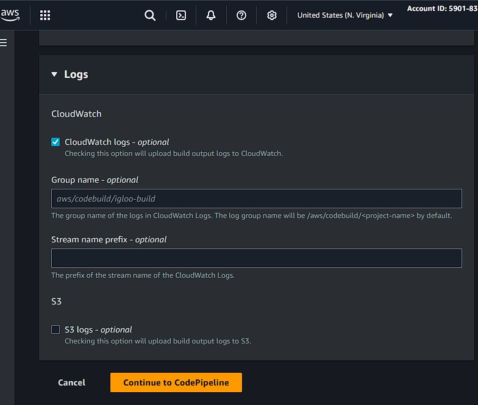

# 🚀 Deploy Re## ➡️ Step 1 - Setup Your React App on GitHub

1. Create or clone your React application repository
2. Ensure your React app is properly configured with:
   - `package.json` with build scripts
   - All necessary dependencies
3. Commit and push your code to GitHub with Full CI/CD Pipeline on AWS

## Overview

This project demonstrates how to set up a complete CI/CD pipeline for a React application using AWS services including CodePipeline, CodeBuild, and S3 for static website hosting.

## <a name="steps">🔧 How it Works:</a>


1. Push code to the `main` branch on GitHub.
2. AWS CodePipeline detects the change.
3. AWS CodeBuild installs dependencies and builds the React app.
4. The build output is deployed to the S3 bucket.
5. S3 serves the app as a public static website.

## ➡️ Step 1 - Setup your React.js App on GitHub


First, we’ll set up a React app by cloning the React app from my GitHub repository. You can use your own or follow along with mine. Make sure the app is committed to GitHub.

```bash
git clone https://github.com/monijaman/CI-CD.git
```

## ➡️ Step 2 - Create S3 Bucket for Hosting

1. Go to AWS S3 service and click **Create bucket**
2. Choose a unique bucket name
3. Keep default settings (we'll configure hosting later)

Next
   
   
   
   

## ➡️ Step 3 - Create CodePipeline

1. Go to AWS CodePipeline and click **Create pipeline**.
2. Name your pipeline: `ms3-codepipeline`.
3. Create a new service role with these permissions:
   - CloudWatchLogsFullAccess
   - S3FullAccess
   - CodeBuildBasePolicy


4. **Add Source Stage:**
   - Source provider: **GitHub** (connect your GitHub account)
   - Select your repository and branch (the one cloned in Step 1)


## ➡️ Step 4 - Create CodeBuild Project

Now let’s set up CodeBuild to build and package your React app for deployment.

**Step-by-step:**

1. Go to AWS CodeBuild and click **Create Build Project**.
2. Name your project (e.g., `react-cicd-pipeline-demo`).
3. **Add Build Stage:**
   - Provider: **AWS CodeBuild**
   - Choose **"Create project"**





## ➡️ Step 5 - Add Deploy Stage

- - Provider: **Amazon S3**
  - Bucket: Select your S3 bucket created earlier
  - Extract file option: **YES**


4. Review configuration and click **"Create pipeline"**.

Once the pipeline is successfully created, you’ll see it run through the `source` `build` and `deploy` stages.


## ➡️ Step 6 - Create CodeBuild Project

- - Update buildspec.yml like below:
- Dont forget to update bucket name

```yaml
version: 0.2

phases:
  install:
    runtime-versions:
      nodejs: 20
    commands:
      - echo Installing dependencies...
      - npm ci --legacy-peer-deps

  build:
    commands:
      - echo "Node.js version:"
      - node --version
      - echo "NPM version:"
      - npm --version
      - echo "Current directory contents:"
      - ls -la
      - echo "Building the React app..."
      - npm run build
      - echo "Build completed successfully"
      - echo "Checking dist directory:"
      - ls -la dist/

  post_build:
    commands:
      - echo Build completed successfully
      - echo "Checking if dist directory exists..."
      - if [ -d "dist" ]; then
        echo "dist directory found, listing contents:";
        ls -la dist/;
        echo "Uploading to S3...";
        aws s3 sync dist/ s3://igloocream  --delete;
        else
        echo "dist directory not found - build may have failed";
        exit 1;
        fi

artifacts:
  files:
    - "**/*"
  base-directory: dist
  discard-paths: no
  name: react-app-build

cache:
  paths:
    - node_modules/**/*
```


## ➡️ Step 7 - Add Bucket Policy

✅ Steps to Add Bucket Policy in AWS Console
Go to the S3 console:
👉 https://s3.console.aws.amazon.com/s3

Click your bucket name (e.g., your-bucket-name).

From the left sidebar, click "Permissions" tab.

Scroll down to Bucket policy section.

Click “Edit” (or “Add policy” if none exists).

Paste your policy below (replacing your-bucket-name with your actual bucket name):

```json
{
  "Version": "2012-10-17",
  "Statement": [
    {
      "Sid": "PublicReadGetObject",
      "Effect": "Allow",
      "Principal": "*",
      "Action": "s3:GetObject",
      "Resource": "arn:aws:s3:::your-bucket-name/*"
    }
  ]
}
```

## ➡️ Step 8 - Fix IAM Permissions (If Build Fails)

1. Go to **IAM Console** → **Roles** → Find your CodeBuild role (e.g., `bangla-service-role`)
2. Add this inline policy:

Your CodeBuild role needs write permissions to the bucket to upload files during your build. Your bucket policy does not grant write permissions or allow your CodeBuild role explicitly.

So you need to attach this inline IAM policy to your CodeBuild service role (replace your-bucket-name with your actual bucket name):

```json
{
  "Version": "2012-10-17",
  "Statement": [
    {
      "Effect": "Allow",
      "Action": ["s3:ListBucket"],
      "Resource": "arn:aws:s3:::your-bucket-name"
    },
    {
      "Effect": "Allow",
      "Action": ["s3:GetObject", "s3:PutObject", "s3:DeleteObject"],
      "Resource": "arn:aws:s3:::your-bucket-name/*"
    }
  ]
}
```

⚠️ **Replace `your-bucket-name` with your actual bucket name**


---

## ➡️ Step 9 - Configure S3 for Static Website Hosting

1. Go to Amazon S3 console and select your bucket.
2. **Enable Static Website Hosting:**
   - Go to **Properties** tab → **"Static Website Hosting"** → **Edit**
   - Choose **Enable** and set `index.html` as index document


3. **Make Bucket Public:**
   - Go to **Permissions** tab
   - Uncheck **"Block all public access"** → **Save changes**


4. **Add Bucket Policy:**
   - In **Permissions** tab → **Bucket policy** → **Edit**
   - Paste this policy (replace `your-bucket-name` with your actual bucket name):
5. You should see the S3 bucket with objects inside, extracted from our CodePipeline.
6. Now let's make this S3 Bucket public:
   <br>- On the top bar, choose "Properties"

<br>- Next, we will add a bucket policy to allow public read access inside our s3 bucket. Here's the sample policy you can use:

## 🎉 Congratulations!

Your React app is now automatically deployed via CI/CD pipeline:

- **Push code** → **GitHub triggers CodePipeline** → **CodeBuild builds** → **Deploys to S3** → **Live website**
